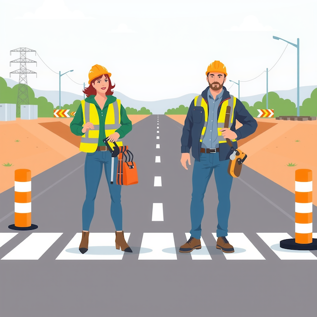
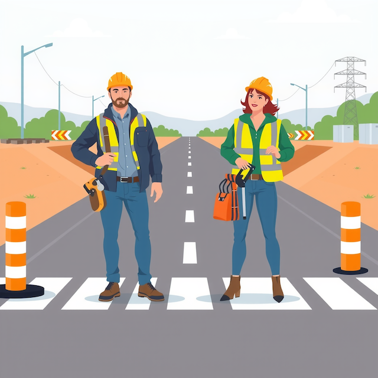

# Sets-Experimentieren-in-der-Psycholinguistik

# Experimentelle Items und Stimuli

Hier werden alle experimentellen Items sowie Filler-Stimuli dargestellt.
Jedes Item wird als Screenshot gezeigt, gefolgt vom zugehörigen Stimulus-Satz.

---

| Bedingung | Beschreibung                                                     |
| --------- | ---------------------------------------------------------------- |
| A         | stereotypverstärkender Kontext + stereotypisch männlicher Beruf  |
| B         | stereotypentschärfender Kontext + stereotypisch männlicher Beruf |
| C         | stereotypverstärkender Kontext + stereotypisch weiblicher Beruf  |
| D         | stereotypentschärfender Kontext + stereotypisch weiblicher Beruf |

---

## Bergarbeiter:in, Bedingung A:

Unter Tage ging es angespannt zu, weil eine besonders furchtlose Vorgehensweise für den Bergarbeiter notwendig war.

## Bergarbeiter:in, Bedienung B: 

Unter Tage ging es angespannt zu, weil eine besonders hilfsbereite Vorgehensweise für die Bergbauarbeitenden notwendig war.

## Cheerleader:in, Bedingung C: 

Vor dem Auftritt war die Stimmung ausgelassen, weil eine besonders mitfühlende Präsentation für den Cheerleader entscheidend war.

## Cheerleader:in, Bedingung D: 

Vor dem Auftritt war die Stimmung lebhaft, weil eine besonders wettbewerbsorientierte Performance für die Cheerleader entscheidend war.

## Geburtshelfer:in, Bedingung C:

Im Kreißsaal wurde ruhig gearbeitet, weil eine besonders fürsorgliche Unterstützung für den Geburtshelfer entscheidend war.

## Geburtshelfer:in, Bedingung D:

Im Kreißsaal wurde konzentriert gearbeitet, weil eine besonders geübte Unterstützung für die Geburtshelfenden entscheidend war.

## Kinderbetreuer:in, Bedingung C:

Im Gruppenraum ging es harmonisch zu, weil eine besonders kommunikative Haltung für den Kinderbetreuer wichtig war.

## Kinderbetreuer:in, Bedingung D:

Im Gruppenraum ging es harmonisch zu, weil eine besonders freundliche Betreuung für die Betreuungspersonen wichtig war.

## Kranführer:in, Bedingung A:

Auf der Baustelle wurde präzise gearbeitet, weil eine besonders ruhige Reaktion in Notfällen für den Kranführer wichtig war.

## Kranführer:in, Bedingung B:

Auf der Baustelle wurde präzise gearbeitet, weil eine besonders zuverlässige Arbeitsweise für die Kranführenden wichtig war.

## Nagelpfleger:in, Bedingung C:

Im Nagelstudio herrschte eine ruhige Atmosphäre, weil eine besonders geduldige Betreuung für den Manikürer erwartet wurde.

## Nagelpfleger:in, Bedingung D:

Im Nagelstudio herrschte eine ruhige Atmosphäre, weil eine besonders kreative Herangehensweise für die Nagelpflegenden erwartet wurde.

## Rennfahrer:in, Bedingung A:

In der Boxengasse ging es hektisch zu, weil eine besonders aggressive Strategie für den Rennfahrer geplant war.

## Rennfahrer:in, Bedingung B:

In der Boxengasse ging es hektisch zu, weil eine besonders verlässliche Strategie für die Rennfahrenden geplant war.

## Sekretär:in, Bedingung C:

Im Büro wurde viel abgestimmt, weil eine besonders verständnisvolle Arbeitsweise für den Sekretär notwendig war.

## Sekretär:in, Bedingung D:

Im Büro wurde viel abgestimmt, weil eine besonders hilfreiche Arbeitsweise für die Büroangestellten notwendig war.

## Straßenarbeiter:in, Bedingung A:

Auf der Baustelle lief alles koordiniert, weil eine besonders selbstständige Arbeitsweise für den Straßenbauarbeiter erwartet wurde.

## Straßenarbeiter:in, Bedingung B:

Auf der Baustelle lief alles dynamisch ab, weil eine besonders aktive Arbeitsweise für die Straßenbauarbeitenden erwartet wurde.

## Truckerfahrer:in, Bedingung A:

An der Raststelle musste schnell gehandelt werden, weil eine besonders entschlossene Entscheidung für den LKW-Fahrer erforderlich war.

## Truckerfahrer:in, Bedingung B:

An der Raststelle musste schnell gehandelt werden, weil eine besonders fähige Entscheidung für die LKW-Fahrenden erforderlich war.

---

## Filler 1

Am Bahnhof wurde aufmerksam orientiert, weil eine besonders präzise Abstimmung der Informationen erforderlich war.

## Filler 2

Auf der Straßewurde hektisch aufgehoben, weil eine besonders strukturierte Anpassung der Materialien notwendig war.

## Filler 3

In einer technischen Umgebung wurde sorgfältig aufgebaut, weil eine besonders exakte Abstimmung der Komponenten entscheidend war.

## Filler 4

In einem Kontrollraum wurde feinjustiert, weil eine besonders präzise Kalibrierung der Geräte erforderlich war.

## Filler 5

Im Lager wurde koordiniert gearbeitet, weil eine besonders organisierte Verteilung der Aufgaben notwendig war.

## Filler 6

Im Veranstaltungssaal wurde geprüft, weil eine besonders kontrollierte Regulierung der Tonanlage erwartet wurde.

## Filler 7

Im Leseraum wurde neu angeordnet, weil eine besonders ausgewogene Platzierung der Sitzmöglichkeiten wichtig war.

## Filler 8

Am Automaten wurde analysiert, weil eine besonders gründliche Überprüfung der Anzeige erforderlich war.

## Filler 9

Im Flur wurde inspiziert, weil eine besonders systematische Einschätzung der Luftzirkulation notwendig war.
